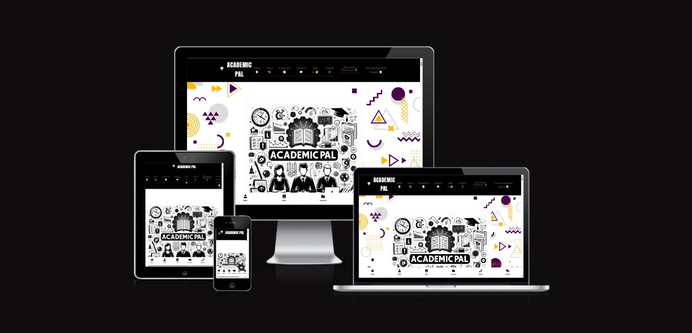

# Academic Pal

<p align="center">
  
</p>

**Academic Pal** is an educational platform designed to provide college students with comprehensive notes, past question papers, important questions, detailed syllabi, and extensive question banks. It serves as an all-in-one resource to enhance students' academic experience and streamline study preparation.

## Features

- **Comprehensive Notes**: High-quality notes across multiple subjects and semesters.
- **Past Question Papers**: Access to previous exam papers to aid in study and revision.
- **Important Questions**: Curated lists of key questions for effective preparation.
- **Detailed Syllabus**: Updated syllabi for each subject and course.
- **Question Banks**: Extensive question banks for deep, subject-specific practice.
- **User-Friendly Navigation**: Easy-to-access layout for quick retrieval of resources.
- **Animated User Interface**: Interactive, modern design with animated elements for an engaging experience.

## Technologies Used

- **HTML**: Structuring the content across different pages.
- **CSS**: Styling the application, creating a clean, attractive UI.
- **JavaScript**: Adding interactivity and handling user actions.
- **APIs**: Fetching content dynamically and providing real-time updates.
- **React** (Optional enhancement): For a smooth, component-based user experience.
- **GSAP/Three.js** (Optional enhancement): For 3D animations and rich interactions.

## Project Structure

The basic structure of the project is as follows:


## Installation and Setup

To set up the Academic Pal project locally, follow these steps:

### Prerequisites

Ensure you have a code editor and a local web server (optional) installed.

### Steps

1. **Clone the Repository**:
   ```bash
   git clone <repository-url>
   cd academic-pal
## Usage

- **Home Page (`index.html`)**: Welcomes users with a brief overview and quick links to various resources.
- **Notes Page (`notes.html`)**: Organized access to notes for different subjects and semesters.
- **Question Papers Page (`question-papers.html`)**: Repository of past exam papers.
- **Syllabus Page (`syllabus.html`)**: Detailed syllabi for each course.
- **Contact Page (`contact.html`)**: Provides support and allows users to get in touch with the team.

## Future Enhancements

- **User Authentication**: Allow users to create accounts to save favorite resources.
- **Personalized Dashboard**: Enable users to track progress and access recent resources.
- **Additional Resources**: Expand to include tutorials, tips, and study guides.

## Contributing

1. **Fork the repository**.
2. **Create a new branch**:
   ```bash
   git checkout -b feature-branch
## License

This code section can be copied directly into your `README.md` file. It explains the usage, future enhancements, contributing steps, and license details in an organized markdown format.

